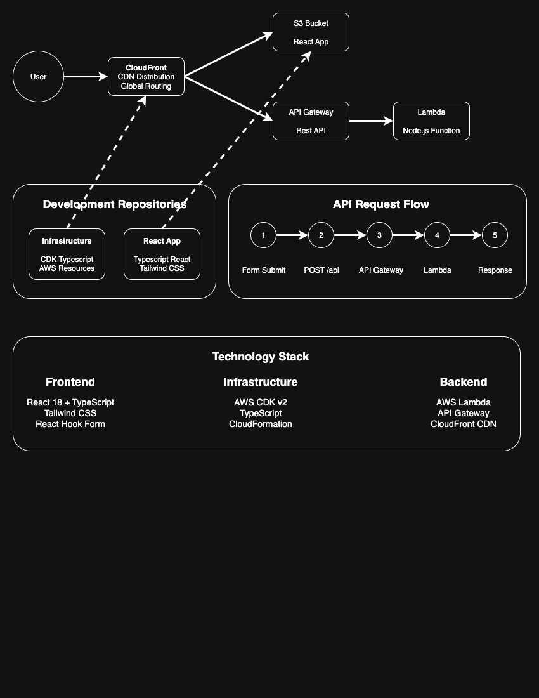

# Welcome to your CDK TypeScript project

This is a blank project for CDK development with TypeScript.

The `cdk.json` file tells the CDK Toolkit how to execute your app.

## Useful commands

* `npm run build`   compile typescript to js
* `npm run watch`   watch for changes and compile
* `npm run test`    perform the jest unit tests
* `npx cdk deploy`  deploy this stack to your default AWS account/region
* `npx cdk diff`    compare deployed stack with current state
* `npx cdk synth`   emits the synthesized CloudFormation template


# React App Infrastructure

AWS CDK stack that deploys the cloud infrastructure for a React application with serverless backend.

## Architecture



- **S3 Bucket**: Private bucket for hosting React static files
- **CloudFront Distribution**: CDN for global content delivery and API routing
- **Lambda Function**: Serverless backend that processes API requests
- **API Gateway**: REST API endpoints with CORS support

## Prerequisites

- AWS CLI configured with appropriate credentials
- Node.js (version 14.15.0 or later)
- AWS CDK CLI: `npm install -g aws-cdk`

## Setup

1. Install dependencies:
   ```bash
   npm install
   ```

2. Bootstrap CDK (first time only):
   ```bash
   cdk bootstrap
   ```

## Deployment

Deploy the infrastructure:
```bash
cdk deploy
```

The deployment will output important values:
- **CloudFrontURL**: Your application's public URL
- **S3BucketName**: Bucket for React app files
- **APIGatewayURL**: Direct API endpoint
- **LambdaFunctionName**: Backend function name

## API Endpoints

- `GET /api` - Test endpoint
- `POST /api` - Accepts JSON with `name` field, returns personalized greeting
- `GET /api/items` - Additional endpoint
- `POST /api/items` - Additional endpoint

## Management

**View deployment status:**
- Check CloudFormation console for real-time deployment progress

**Update infrastructure:**
```bash
cdk deploy
```

**Destroy infrastructure:**
```bash
cdk destroy
```

**Preview changes:**
```bash
cdk diff
```

## File Structure

```
├── bin/
│   └── my-app-infrastructure.ts    # CDK app entry point
├── lib/
│   └── react-app-stack.ts          # Main infrastructure stack
├── package.json
├── cdk.json
└── tsconfig.json
```

## Notes

- The S3 bucket blocks all public access; files are served via CloudFront with Origin Access Identity
- Lambda function includes CORS headers for cross-origin requests
- CloudFront error responses redirect 404/403 to index.html for React routing
- All resources are configured with `removalPolicy: DESTROY` for easy cleanup